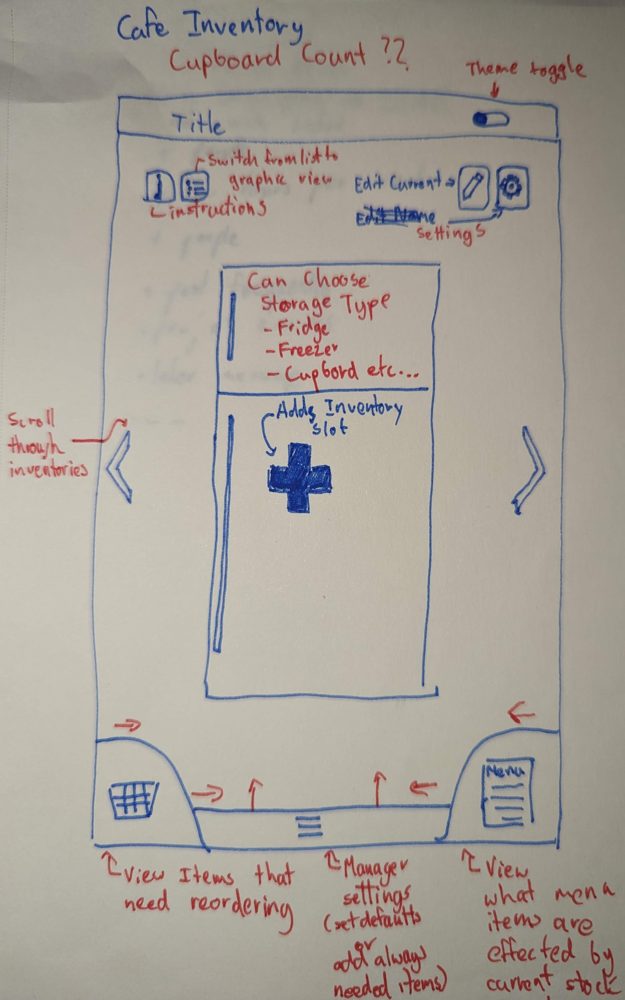

# Cafe-Inventory

A scaleable app that allows the user to select locations based off cupboards, different fridge types and other storage locations and create small easily adjustable inventories for each.
Employees will be able to select and modify contents of each storage option added.
This is an external project in cooperation with a local cafe that at current wishes to be unnamed.

## Requested Starting Features

- Seperate Storage labels corisponding to location (Fridge, Freezer, Cupboard)
- Deafault list of objects that are needed on hand at all times
- Notification via email or other for when an item goes below a certain threshold
- Sign in system for manager vs employee with different access and functionality
- Main use would be tablets or phones
- Initial Theme should be pastel colors
- Items need to store name, size, storage requirement, is it opened, order type as pickup vs delivery

## Future feature Requests

- Recipe / menu checker showing what can and cannot be prepared with current inventory
- Tracking for expiry and if larger items have been open, marking more urgent to be used first
- End of shift reminder for items that need to be aquired by a manager

